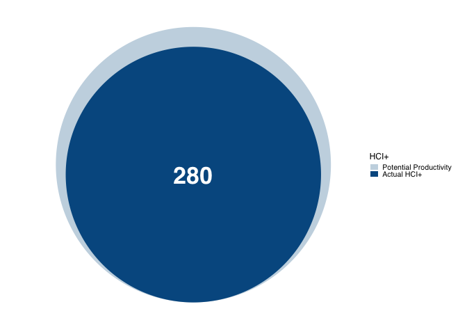

<!-- README.md is generated from README.Rmd. Please edit that file -->

# hciplusbrief

<!-- badges: start -->

<!-- badges: end -->

hciplusbrief provides lightweight, publication-ready visuals for HCI+
briefs and reporting. A key feature is the HCI+ progress bubble chart,
which compares potential (maximum) HCI+ to achieved HCI+.

## Installation

You can install the development version of hciplusbrief from
[GitHub](https://github.com/) with:

``` r
# install.packages("pak")
pak::pak("fbw1/hciplusbrief")
#>  Found  1  deps for  0/1  pkgs [⠋] Resolving fbw1/hciplusbrief Found  1  deps for  0/1  pkgs [⠙] Resolving fbw1/hciplusbrief Found  1  deps for  0/1  pkgs [⠹] Resolving fbw1/hciplusbrief Found  1  deps for  0/1  pkgs [⠸] Resolving fbw1/hciplusbriefChecking for 15 new metadata files                             Found  9  deps for  1/1  pkgs [⠼] Resolving standard (CRAN/BioC) packages⠋ Updating metadata database [0/15] | Downloading [0 B / 0 B]              Found  9  deps for  1/1  pkgs [⠴] Resolving standard (CRAN/BioC) packages⠙ Updating metadata database [4/15] | Downloading [32.77 kB / 1.42 MB]     Found  9  deps for  1/1  pkgs [⠦] Resolving standard (CRAN/BioC) packages⠹ Updating metadata database [8/15] | Downloading [1.43 MB / 1.42 MB]      Found  9  deps for  1/1  pkgs [⠧] Resolving standard (CRAN/BioC) packages⠸ Updating metadata database [10/15] | Downloading [2.24 MB / 7.20 MB]     Found  9  deps for  1/1  pkgs [⠇] Resolving standard (CRAN/BioC) packages⠼ Updating metadata database [11/15] | Downloading [3.12 MB / 7.20 MB]     Found  9  deps for  1/1  pkgs [⠏] Resolving standard (CRAN/BioC) packages⠴ Updating metadata database [11/15] | Downloading [3.36 MB / 7.20 MB]     Found  9  deps for  1/1  pkgs [⠋] Resolving standard (CRAN/BioC) packages⠦ Updating metadata database [11/15] | Downloading [3.89 MB / 7.20 MB]     Found  9  deps for  1/1  pkgs [⠙] Resolving standard (CRAN/BioC) packages⠧ Updating metadata database [11/15] | Downloading [4.96 MB / 7.20 MB]     Found  9  deps for  1/1  pkgs [⠹] Resolving standard (CRAN/BioC) packages⠇ Updating metadata database [11/15] | Downloading [7.20 MB / 7.20 MB]    ✔ Updated metadata database: 7.20 MB in 4 files.                      
#>  Found  9  deps for  1/1  pkgs [⠹] Resolving standard (CRAN/BioC) packagesℹ Updating metadata database                                              ✔ Updating metadata database ... done
#>  Found  9  deps for  1/1  pkgs [⠹] Resolving standard (CRAN/BioC) packages Found  9  deps for  1/1  pkgs [⠸] Resolving standard (CRAN/BioC) packages Found  9  deps for  1/1  pkgs [⠼] Resolving standard (CRAN/BioC) packages                                                                           
#> ℹ No downloads are needed
#> Installing...             ✔ 1 pkg + 31 deps: kept 32 [9.2s]
```

## Example

### HCI+ progress bubble chart

The progress bubble chart displays: - an outer bubble for Potential
Productivity (max HCI+) - an inner bubble for Actual HCI+ (progress
toward the max)

The inner bubble is scaled so that its area is proportional to
`progress / max_value`.

``` r
library(hciplusbrief)

progress_bubble_hci(
  value = 280,
  progress = 280,
  max_value = 325,
  title = "HCI+"
)
```


